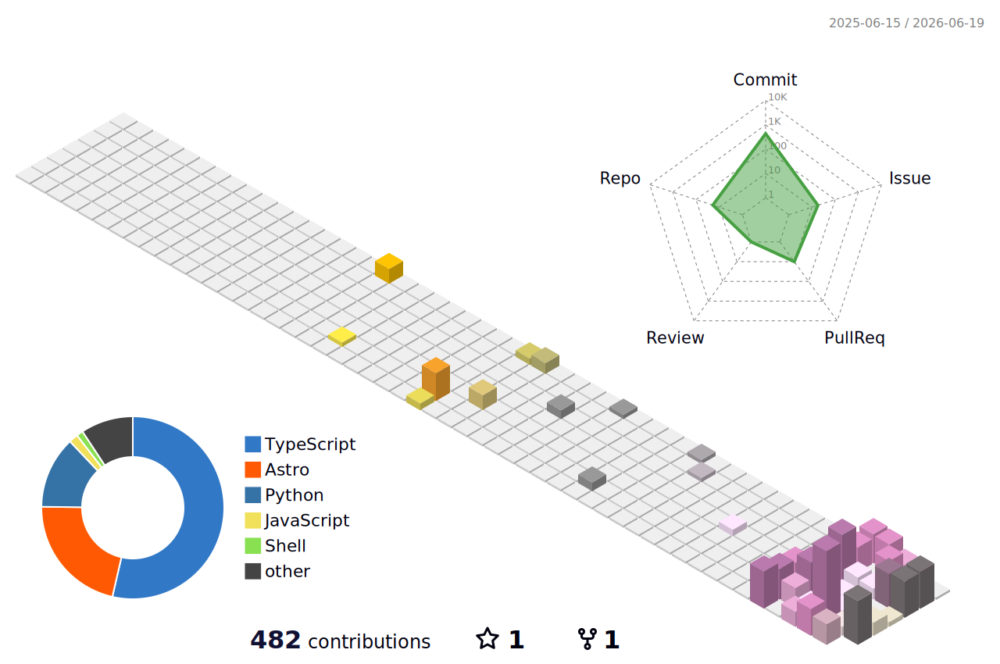

# Keitaro Ueki

 
 

 

 

 

<h2>Featured Projects</h2>

| Project | Stack | Description |
| :-- | :-- | :-- |
| [slide-generator](https://github.com/97kuek/slide-generator) | CSS / Marp | GitHub の Issue を起票するだけで、Claude が Marp スライドを自動生成して PR を作成するシステム |
| [katekyo](https://github.com/97kuek/katekyo) | TypeScript | 家庭教師と生徒の間で宿題の進捗・成績を管理する Web アプリ |
| [Motion-Detection-App](https://github.com/97kuek/Motion-Detection-App) | Python | 動体検知アプリケーション |
| [xfoil-3d](https://github.com/97kuek/xfoil-3d) | Python | XFOIL を用いた翼解析プロジェクト |
| [fusion-wing-importer](https://github.com/97kuek/fusion-wing-importer) | Python | Fusion 360 向けの翼形状インポートツール |
| [sensors-and-control](https://github.com/97kuek/sensors-and-control) | C++ | センサと制御の実装 |

 

<h2>Latest Articles</h2>

<!-- BLOG-POST-LIST:START -->
<table>
<tr><td align="center" width="33%" valign="top"> <a href="https://97kuek.github.io/blog/aqua-voice-discount/"><b>Aqua Voiceの年間プランを学割で契約する方法（.eduメールがなくてもOK）</b></a> 2026-07-15</td><td align="center" width="33%" valign="top"> <a href="https://97kuek.github.io/blog/fork-exec-wait/"><b>fork・exec・waitで理解するプロセス生成の流れ</b></a> 2026-07-13</td><td align="center" width="33%" valign="top"> <a href="https://97kuek.github.io/blog/slide-generator/"><b>GitHub Issues × Claude AI でスライドを自動生成する仕組みを作る</b></a> 2026-05-31</td></tr>
<tr><td align="center" width="33%" valign="top"> <a href="https://97kuek.github.io/blog/transformer/"><b>Transformerの設計意図を直感的に理解する</b></a> 2026-04-24</td><td align="center" width="33%" valign="top"> <a href="https://note.com/97kuek_/n/nac57d3658f47"><b>[note] 早稲田大学基幹理工学部2年生を振り返ってみる。</b></a> 2026-03-06</td><td align="center" width="33%" valign="top"> <a href="https://97kuek.github.io/blog/github-actions/"><b>GitHub ActionsでGitHub Pagesに自動デプロイする</b></a> 2025-11-02</td></tr>
</table>
<!-- BLOG-POST-LIST:END -->

Auto-updated from <a href="https://97kuek.github.io/">97kuek.github.io</a>

 

<h2>3D Contribution Graph</h2>

  

