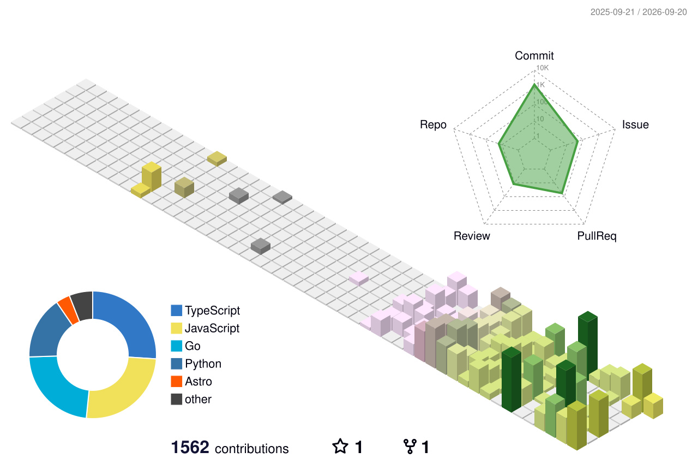

# Keitaro Ueki

## About

- [早稲田大学基幹理工学部情報通信学科](https://www.comm.waseda.ac.jp/)・B3
- [株式会社neoAI](https://neoai.jp/) AIエンジニア（インターン）
- 元 [早稲田大学宇宙航空研究会WASA 鳥人間プロジェクト](https://wasa-birdman.com/)
- [ポートフォリオサイト](https://97kuek.pages.dev/)

 

 

<h2>Projects</h2>

| Project | Stack | Description |
| :-- | :-- | :-- |
| [wasa-chat](https://github.com/97kuek/wasa-chat) | Go / Python / RAG | 部内Wikiと公開資料を横断して質問できる、出典付きのRAGチャットボット |
| [flow5ctl](https://github.com/97kuek/flow5ctl) | Python / MCP | flow5のバッチエンジンをAIエージェントから駆動する、低レイノルズ数機体の設計・解析ツール |
| [toggl-slack-tasks](https://github.com/97kuek/toggl-slack-tasks) | TypeScript / Cloudflare Workers | Moodleの課題と手動タスクをSlackへ集約し、その場でTogglの時間計測まで行えるボット |
| [HRS](https://github.com/97kuek/HRS) | TypeScript / Next.js | UMLによる分析・設計から実装まで通しで担当したホテル予約Webアプリ |

 

<h2>Contribution Graph</h2>

  

## Contact

- [keitaro.ueki@asagi.waseda.jp](mailto:keitaro.ueki@asagi.waseda.jp)
